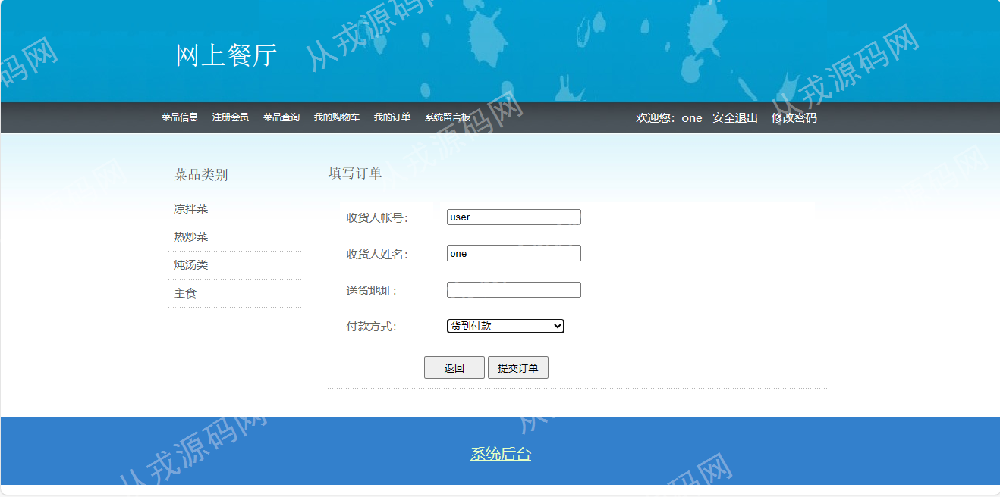

<h1 align="center">71.网上餐厅管理系统</h1>

 获取sql文件 QQ: 386869957 QQ群: 377586148 

 [推荐站点: 从戎源码网](https://armycodes.com/) 

## 简介

> 本代码来源于网络,仅供学习参考使用!
>
> 提供1.远程部署/2.修改代码/3.设计文档指导/4.框架代码讲解等服务
> 
> 管理后台登录地址：http://localhost:8080/dingcan/login.jsp
> 
> 管理员：admin 1
> 
> 网站前台：http://localhost:8080/dingcan/
> 
> 用户：user 1
>

## 项目介绍
基于jsp+servlet的网上餐厅管理系统：前端jsp、js、fckeditor，后端 servlet、jdbc，集成菜品查询、在线订餐、购物车、我的订单等功能于一体的系统。

## 功能介绍

### 用户

- 基本功能：登录，注册，安全退出、修改密码
- 菜品信息：菜品列表，左侧分类导航栏，菜品详情，根据菜名查询
- 在线订餐：在菜品详情页输入数量，然后点击购买，跳转到购物车页面，购物车可以同时结账多个菜品，也可以调整数量和删除多余菜品，点击结账然后填收货人信息提交订单
- 我的订单：已经下单后，可以在我的订单里进行查询
- 系统留言：可以给商家留言、评论菜品

### 管理员

- 菜品类别管理：菜品类别的增删改查
- 菜品信息管理：菜品信息的增删改查，添加和修改菜品时需要选择类别信息，菜品图片上传，菜品介绍内容支持富文本编辑
- 会员信息管理：会员信息的删改查，会员信息由用户在网站前台自行注册，管理员可以给用户重置密码
- 订单信息管理：订单列表查询，明细查看，下单用户查看，订单删除，订单计时，订单受理
- 留言信息管理：留言列表查询，留言删除，留言回复

## 环境

- <b>IntelliJ IDEA 2009.3</b>

- <b>Mysql 5.7.26</b>

- <b>Tomcat 7.0.73</b>

- <b>JDK 1.8</b>

## 运行截图

